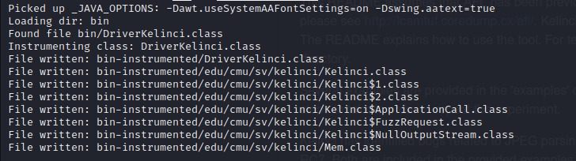
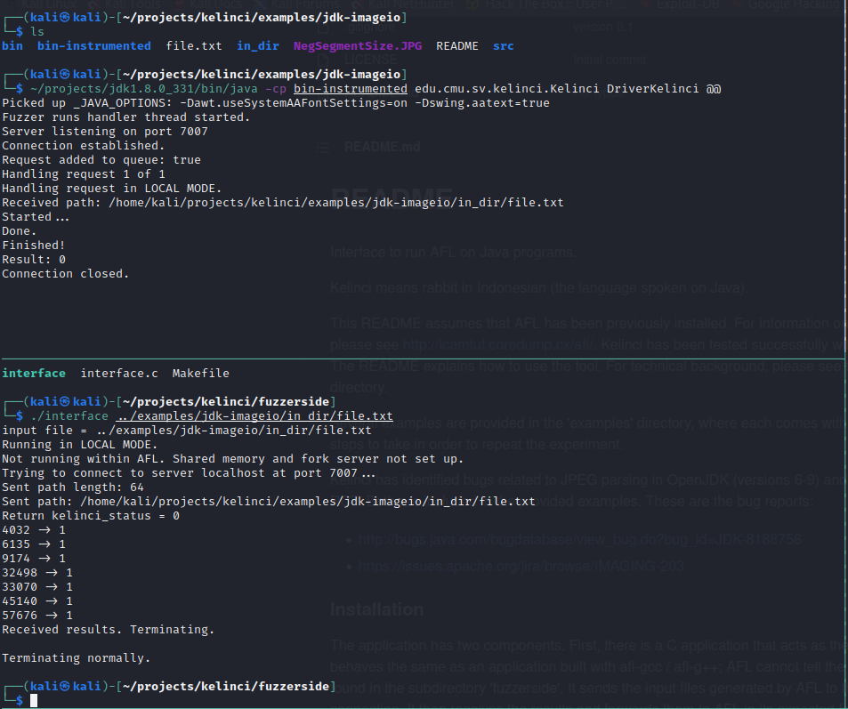
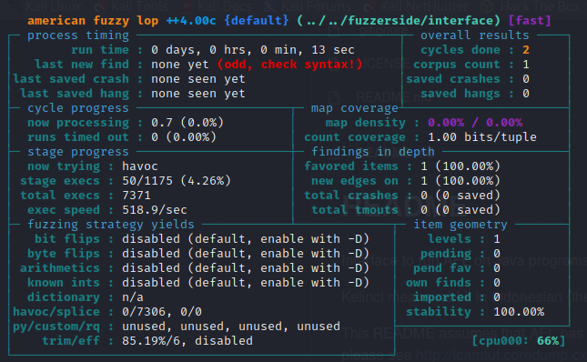

# AFL Fuzzing Java Programs 

> Kelinci with AFL can be used to fuzz Java compiled programs. This is called Instrumentation. 

Must use java 8 through entire process. 

#### Compile java Program 
	javac src/*.java -d bin   
	
#### Instrumentation command 
	~/projects/jdk1.8.0_331/bin/java -cp ~/projects/kelinci/instrumentor/build/libs/kelinci.jar edu.cmu.sv.kelinci.instrumentor.Instrumentor -i bin -o bin-instrumented

#### Test Kelinci Server
	java -cp bin-instrumented edu.cmu.sv.kelinci.Kelinci DriverKelinci @@
	
Then, in another window activate the interface and specify an input file. 

	../../fuzzerside/interface in_dir/file.txt
	
#### Run AFL
	afl-fuzz -i in_dir -o out_dir ../../fuzzerside/interface @@
	
	

	

